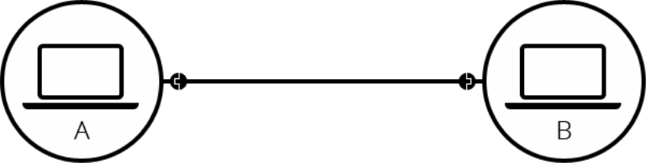

# Internet & Network’s Structure

## 인터넷(Internet)이란?

TCP/IP 프로토콜을 기반으로 하여 전세계의 컴퓨터들이 연결된 광범위한 통신망이며, 작은 네트워크들을 이어주기 때문에 네트워크의 네트워크라고 불리기도 한다.

## 네트워크(Network)란?

네트워크는 기본적으로 통신 기술을 이용한 공유환경으로 두개 이상의 컴퓨터가 다른 컴퓨터와 통신하기 위한 장치와 시스탬의 집합이다.

## 인터넷의 구성

기본적으로 컴퓨터끼리 통신을 하기 위해서는 유선또는 무선으로 연결되면된다. (기본 네트워크)

2대의 컴퓨터의 통신

하지만, 이렇게 연결하기에는 컴퓨터의 수가 늘어난다면 현실적으로 제한사항이 많이 걸리게된다.

10대의 컴퓨터의 통신

이러한 문제를 해결하기 위해 나온 기기가 라우터(router)이다. 라우터는 특수한 소형컴퓨터로 이루어져있으며 원하는 정보를 원하는 컴퓨터로 연결해주는 역할을 한다.

또한, 라우터도 컴퓨터의 일종이기 때문에 아래의 그림처럼 라우터끼리 연결하여 네트워크를 확장시킬 수 도 있다.

하지만, 이렇게 된다면 부산에서 서울에 있는 컴퓨터와 통신을 하려면 서울에서 부산까지 통신선을 연결해야한다. 하지만 이것은 비용이 많이 발생하며 중간에 손상이 발생 확률이 크기 때문에 등장한것이 모뎀(MODEM)이다. 모뎀은 데이터를 전화 시설에서 해독할 수 있는 정보로 바꿈으로써 멀리 떨어진 네트워크끼리 교환한데에 도움을 준다.

